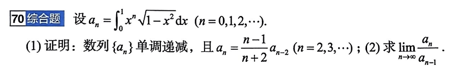

# 题目讲解 2026-09-23_09-49-05_02

- 记录时间：2026-09-23 09:49:05
- 时区：Asia/Shanghai（UTC+08:00）
- 原图相对路径：photo/2026-09-23_09-49-05_02_01.png
- 保存说明：补存此前第 2 次上传的原图和解析；两次上传为同一道题，解析使用已核对的完整解答。
- Notion 同步状态：已同步，完整题干与解析已上传并重新读取核验。
- Notion 页面：https://www.notion.so/3e4867d026d980a9b79ce8eeb831631a
- Notion 位置：2026年 → 09月 → 23日 → 第 70 题 · 题干 / 第 70 题 · 解析。
- 同步说明：两份本地记录对应同一道题，共用 Notion 中的一组题干/解析折叠块；原图继续保存在本地。

## 原题与题图

**70 综合题**

设

$$
a_n=\int_0^1 x^n\sqrt{1-x^2}\,\mathrm dx,\qquad n=0,1,2,\ldots
$$

（1）证明数列 $\{a_n\}$ 单调递减，且

$$
a_n=\frac{n-1}{n+2}a_{n-2},\qquad n=2,3,\ldots
$$

（2）求

$$
\lim_{n\to\infty}\frac{a_n}{a_{n-1}}.
$$

## 条件与前提检查

题目条件完整，所给递推式正确。积分在 $[0,1]$ 上存在，且 $a_n>0$；分部积分证明递推式时须使用 $n\ge2$，确保下端点的边界项为零。

## 解题思路

在 $0<x<1$ 上比较相邻幂函数得到单调性；分部积分联系 $a_n$ 与 $a_{n-2}$；最后利用单调性把相邻项比值夹在趋于 $1$ 的下界与 $1$ 之间，无需求出通项。

## 详细解析

题目条件完整，所给递推式正确。核心思路是：**比较被积函数证明单调性，用分部积分建立递推式，再用单调性和递推式夹出极限。**

已知

$$
a_n=\int_0^1 x^n\sqrt{1-x^2}\,\mathrm dx,\qquad n=0,1,2,\ldots
$$

**一、证明数列 $\{a_n\}$ 单调递减**

先注意：在 $0<x<1$ 时，被积函数为正，所以 $a_n>0$，后面可以放心地用它作分母。

为什么 $a_n$ 会随着 $n$ 增大而减小？因为**小于 $1$ 的正数，乘的次数越多，结果越小**。对任意 $0<x<1$，都有

$$
x^{n+1}<x^n.
$$

严格地写成积分之差：

$$
\begin{aligned}
a_n-a_{n+1}
&=\int_0^1\left(x^n-x^{n+1}\right)\sqrt{1-x^2}\,\mathrm dx\\
&=\int_0^1x^n(1-x)\sqrt{1-x^2}\,\mathrm dx\\
&>0.
\end{aligned}
$$

最后一步成立，是因为被积函数在整个开区间 $(0,1)$ 上都为正。

因此

$$
\boxed{a_{n+1}<a_n},
$$

即数列 $\{a_n\}$ 严格单调递减。

**二、证明递推式**

要让 $a_n$ 与 $a_{n-2}$ 联系起来，关键是把 $x^n$ 拆成 $x^{n-1}\cdot x$：

$$
a_n=\int_0^1x^{n-1}\cdot x\sqrt{1-x^2}\,\mathrm dx.
$$

这样拆的好处是，$x\sqrt{1-x^2}$ 很容易积分：

$$
\int x\sqrt{1-x^2}\,\mathrm dx
=-\frac13(1-x^2)^{3/2}.
$$

于是用分部积分，取

$$
u=x^{n-1},\qquad
\mathrm dv=x\sqrt{1-x^2}\,\mathrm dx,
$$

则

$$
\mathrm du=(n-1)x^{n-2}\,\mathrm dx,\qquad
v=-\frac13(1-x^2)^{3/2}.
$$

当 $n\ge2$ 时，

$$
a_n
=\left.-\frac13x^{n-1}(1-x^2)^{3/2}\right|_0^1
+\frac{n-1}{3}\int_0^1x^{n-2}(1-x^2)^{3/2}\,\mathrm dx.
$$

边界项等于 $0$：上端点 $x=1$ 时，$1-x^2=0$；下端点 $x=0$ 时，由于 $n-1\ge1$，$x^{n-1}=0$。

接下来，把积分整理成我们认识的 $a_{n-2}$ 和 $a_n$。利用

$$
(1-x^2)^{3/2}=(1-x^2)\sqrt{1-x^2},
$$

得到

$$
\begin{aligned}
a_n
&=\frac{n-1}{3}\int_0^1x^{n-2}(1-x^2)\sqrt{1-x^2}\,\mathrm dx\\
&=\frac{n-1}{3}\left(
\int_0^1x^{n-2}\sqrt{1-x^2}\,\mathrm dx
-\int_0^1x^n\sqrt{1-x^2}\,\mathrm dx
\right)\\
&=\frac{n-1}{3}(a_{n-2}-a_n).
\end{aligned}
$$

移项整理：

$$
3a_n=(n-1)a_{n-2}-(n-1)a_n,
$$

所以

$$
\boxed{a_n=\frac{n-1}{n+2}a_{n-2}},\qquad n\ge2.
$$

**三、求 $\displaystyle\lim_{n\to\infty}\frac{a_n}{a_{n-1}}$**

这一问的关键是：**递推式给出了“隔一项的比值”，单调性可以把“相邻项的比值”夹在它和 $1$ 之间。**

由正性和单调性，当 $n\ge2$ 时，

$$
0<a_n<a_{n-1}<a_{n-2}.
$$

一方面，由 $a_n<a_{n-1}$，得到

$$
\frac{a_n}{a_{n-1}}<1.
$$

另一方面，分子同为正数 $a_n$，分母越大，比值越小。由于 $a_{n-1}<a_{n-2}$，所以

$$
\frac{a_n}{a_{n-1}}>\frac{a_n}{a_{n-2}}
=\frac{n-1}{n+2}.
$$

合起来就是

$$
\frac{n-1}{n+2}<\frac{a_n}{a_{n-1}}<1.
$$

而

$$
\lim_{n\to\infty}\frac{n-1}{n+2}
=\lim_{n\to\infty}\left(1-\frac3{n+2}\right)
=1.
$$

由夹逼定理，

$$
\boxed{\displaystyle\lim_{n\to\infty}\frac{a_n}{a_{n-1}}=1}.
$$

**易错点：**仅凭“数列为正且单调递减”，不能断言相邻项比值趋于 $1$。例如 $b_n=2^{-n}$ 也为正且单调递减，但 $b_n/b_{n-1}=1/2$。本题还用到了递推式，它提供了趋于 $1$ 的下界。

## 最终答案

$$
a_{n+1}<a_n,\qquad
a_n=\frac{n-1}{n+2}a_{n-2}\ (n\ge2),\qquad
\lim_{n\to\infty}\frac{a_n}{a_{n-1}}=1.
$$

## 检验与易错点

- 积分值为正，因此比值中的分母不为零。
- 递推式仅用于 $n\ge2$，不能直接套到 $n=0$ 或 $n=1$。
- 数列单调递减本身不能推出相邻项比值趋于 $1$，还必须用递推式提供夹逼下界。
- 两个原图分别保留，避免把重复上传误作新的题目。
