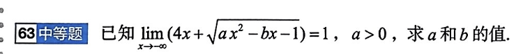

# 题目讲解 2026-09-23_10-25-43

- 记录时间：2026-09-23 10:25:43
- 时区：Asia/Shanghai（UTC+08:00）
- 原图相对路径：photo/2026-09-23_10-25-43.png
- 保存说明：补存本次第 63 题原图与完整解析。
- Notion 同步状态：待同步，尚未提供目标数据库链接或 ID。

## 原题与题图

**63 中等题**

已知

$$
\lim_{x\to-\infty}\left(4x+\sqrt{ax^2-bx-1}\right)=1,\qquad a>0,
$$

求 $a$ 和 $b$ 的值。

## 条件与前提检查

题目条件完整，没有相互矛盾的前提。极限方向是 $x\to-\infty$，根号覆盖整个 $ax^2-bx-1$。

由于 $a>0$，当 $x$ 足够负时，$ax^2-bx-1>0$，根式有意义。求负无穷处的极限，不要求根式对所有实数 $x$ 都有定义。

## 解题思路

已知原式趋于有限的数 $1$，要求确定两个参数。先利用一次主导项必须抵消的条件确定 $a$，再用有理化求出 $b$。

关键是 $x\to-\infty$ 时 $x<0$，因此 $\sqrt{x^2}=|x|=-x$，不能漏掉负号。

## 详细解析

**第一步：利用主导项抵消，求出 $a$。**

当 $x<0$ 时，

$$
\sqrt{ax^2-bx-1}
=-x\sqrt{a-\frac bx-\frac1{x^2}}.
$$

当 $x\to-\infty$，根号内的 $-\frac bx$ 和 $-\frac1{x^2}$ 都趋于 $0$。因此，根号这一项的主要部分是 $-\sqrt a\,x$，与前面的 $4x$ 相加，主要部分就是

$$
(4-\sqrt a)x.
$$

要让原式趋于有限的数 $1$，这个一次项必须抵消，所以应当有 $4-\sqrt a=0$。

严格写法也很简单：原式趋于 $1$，将它除以趋于 $-\infty$ 的 $x$，所得极限就是 $0$。于是

$$
\begin{aligned}
0
&=\lim_{x\to-\infty}\frac{4x+\sqrt{ax^2-bx-1}}{x}\\
&=\lim_{x\to-\infty}\left(4-\sqrt{a-\frac bx-\frac1{x^2}}\right)\\
&=4-\sqrt a.
\end{aligned}
$$

所以

$$
\boxed{a=16}.
$$

**第二步：代入 $a=16$，利用有理化求 $b$。**

此时要求

$$
\lim_{x\to-\infty}\left(4x+\sqrt{16x^2-bx-1}\right)=1.
$$

这里不能把两个部分分别求极限再相加，因为它们分别趋于 $-\infty$ 和 $+\infty$。乘以共轭式，利用平方差消掉二次项：

$$
\begin{aligned}
4x+\sqrt{16x^2-bx-1}
&=\frac{(16x^2-bx-1)-16x^2}{\sqrt{16x^2-bx-1}-4x}\\
&=\frac{-bx-1}{\sqrt{16x^2-bx-1}-4x}.
\end{aligned}
$$

当 $x$ 足够负时，根式有定义，而且分母为正，因此这一步变形合法。

分子、分母同时除以 $-x$。再次注意 $x<0$，得到

$$
\frac{-bx-1}{\sqrt{16x^2-bx-1}-4x}
=\frac{b+\frac1x}{\sqrt{16-\frac bx-\frac1{x^2}}+4}.
$$

让 $x\to-\infty$，含 $\frac1x$、$\frac1{x^2}$ 的项都趋于 $0$，因此

$$
1=\frac{b}{4+4}=\frac b8.
$$

所以

$$
\boxed{b=8}.
$$

## 最终答案

$$
\boxed{a=16,\qquad b=8}.
$$

## 检验与易错点

代回 $a=16$、$b=8$，有

$$
\lim_{x\to-\infty}\left(4x+\sqrt{16x^2-8x-1}\right)
=\lim_{x\to-\infty}\frac{8+\frac1x}{\sqrt{16-\frac8x-\frac1{x^2}}+4}
=\frac88=1,
$$

且 $a=16>0$，满足原题条件。

- $\sqrt{x^2}$ 始终等于 $|x|$；本题 $x$ 趋于负无穷，必须取 $-x$。
- 无穷大不能像普通数字一样相加，不能直接将 $-\infty$ 与 $+\infty$ 抵消成 $0$。
- 主导项抵消只能先确定 $a$；要求出剩下的有限极限，还需要有理化，保留含 $b$ 的项。
