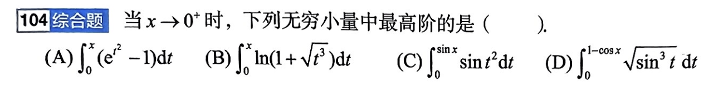

# 题目讲解 2026-09-24_11-40-38

- 记录时间：2026-09-24 11:40:38
- 时区：Asia/Shanghai（UTC+08:00）
- 原图相对路径：photo/2026-09-24_11-40-38.png
- Notion 同步状态：已同步，完整题干与解析已上传并重新读取核验。
- Notion 页面：https://www.notion.so/3e4867d026d980a9b79ce8eeb831631a
- Notion 位置：2026年 → 09月 → 24日 → 第 104 题 · 题干 / 第 104 题 · 解析。

## 原题与题图

**104 综合题**

当 $x\to0^+$ 时，下列无穷小量中最高阶的是（　）。

- （A）$\displaystyle\int_0^x(e^{t^2}-1)\,\mathrm dt$
- （B）$\displaystyle\int_0^x\ln(1+\sqrt{t^3})\,\mathrm dt$
- （C）$\displaystyle\int_0^{\sin x}\sin(t^2)\,\mathrm dt$
- （D）$\displaystyle\int_0^{1-\cos x}\sqrt{\sin^3 t}\,\mathrm dt$

## 条件与前提检查

题目给定 $x\to0^+$，因此积分上限 $x$、$\sin x$ 和 $1-\cos x$ 在充分靠近 $0$ 时均为正；四个积分都有定义且趋于 $0$。根号分别覆盖 $t^3$ 和 $\sin^3t$。这里的“阶”按 $x$ 的幂次比较，正幂指数越大，无穷小量的阶越高。

## 解题思路

先用 $t\to0^+$ 时的等价无穷小找出各被积函数的主要幂次，再积分。对于变动上限，最后还要把上限换算成 $x$ 的幂次。

## 详细解析

当 $t\to0^+$ 时，$e^{t^2}-1\sim t^2$，$\ln(1+t^{3/2})\sim t^{3/2}$，$\sin(t^2)\sim t^2$，而 $\sqrt{\sin^3t}=(\sin t)^{3/2}\sim t^{3/2}$。这些函数在所用积分区间内非负，且上述等价关系可用于积分，因此

$$
\begin{aligned}
\text{A}&\sim\int_0^x t^2\,\mathrm dt=\frac{x^3}{3},\\
\text{B}&\sim\int_0^x t^{3/2}\,\mathrm dt=\frac{2}{5}x^{5/2}.
\end{aligned}
$$

对于 C，$\sin x\sim x$，所以

$$
\text{C}\sim\int_0^{\sin x}t^2\,\mathrm dt
=\frac{(\sin x)^3}{3}\sim\frac{x^3}{3}.
$$

对于 D，$1-\cos x\sim x^2/2$。先对 $t^{3/2}$ 积分，再代入上限的主要部分：

$$
\begin{aligned}
\text{D}&\sim\int_0^{1-\cos x}t^{3/2}\,\mathrm dt
=\frac{2}{5}(1-\cos x)^{5/2}\\
&\sim\frac{2}{5}\left(\frac{x^2}{2}\right)^{5/2}
=\frac{x^5}{10\sqrt2}.
\end{aligned}
$$

四项相对于 $x$ 的阶数依次为 $3$、$5/2$、$3$、$5$。指数最大的 $5$ 对应 D。

## 最终答案

**选 D。**

## 检验与易错点

当 $x\to0^+$ 时，$x^5/x^3=x^2\to0$，且 $x^5/x^{5/2}=x^{5/2}\to0$，所以 D 确实比其余各项趋于零更快。比较 D 时不能只看被积函数的 $t^{3/2}$：积分上限 $1-\cos x$ 本身是 $x$ 的二阶无穷小。
