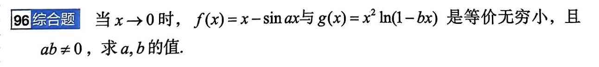

# 题目讲解及时间标识：2026-09-24_11-49-09

- **记录时间**：2026-09-24 11:49:09
- **时区**：Asia/Shanghai（CST，UTC+08:00）
- **原图**：
- **Notion 同步状态**：已同步至 2026年 → 09月 → 24日，第 96 题；[题库页面](https://app.notion.com/p/3e4867d026d980a9b79ce8eeb831631a)

## 第 96 题 · 原题

**96 综合题**

当 $x\to0$ 时，$f(x)=x-\sin ax$ 与 $g(x)=x^2\ln(1-bx)$ 是等价无穷小，且 $ab\ne0$，求 $a,b$ 的值。

## 条件与前提检查

- 题目给出 $x\to0$、$ab\ne0$，并要求 $f(x)$ 与 $g(x)$ 等价，即 $\displaystyle\lim_{x\to0}\frac{f(x)}{g(x)}=1$。
- $a,b$ 是常数。因 $1-bx\to1$，对充分接近 0 的 $x$，对数有定义。
- 由 $b\ne0$ 及 $\ln(1-bx)\sim-bx$，可得 $g(x)\sim-bx^3$。

## 解题思路

先看 $g(x)$ 是三阶无穷小。等价要求 $f(x)$ 也没有一次项，这会确定 $a$；再比较两者三阶项的系数，确定 $b$。

## 详细解析

等价无穷小满足 $f(x)/g(x)\to1$。又因为

$$
g(x)=x^2\ln(1-bx)\sim-bx^3,
$$

所以 $f(x)$ 也必须是三阶无穷小，特别地 $f(x)/x\to0$。

对任意常数 $a$，利用 $\sin(ax)/x\to a$，有

$$
\lim_{x\to0}\frac{f(x)}x
=\lim_{x\to0}\left(1-\frac{\sin(ax)}x\right)
=1-a.
$$

因此 $1-a=0$，得到 $a=1$。

代入 $a=1$。由泰勒展开 $\sin x=x-\frac{x^3}{6}+o(x^3)$，

$$
\lim_{x\to0}\frac{x-\sin x}{x^3}=\frac16.
$$

同时，令 $u=-bx$，由 $\ln(1+u)\sim u$ 得

$$
\lim_{x\to0}\frac{\ln(1-bx)}x=-b.
$$

于是

$$
\lim_{x\to0}\frac{x-\sin x}{x^2\ln(1-bx)}
=\frac{\displaystyle\lim_{x\to0}\frac{x-\sin x}{x^3}}
{\displaystyle\lim_{x\to0}\frac{\ln(1-bx)}x}
=\frac{1/6}{-b}=-\frac1{6b}.
$$

题目要求该极限等于 1，所以 $-\frac1{6b}=1$，从而 $b=-\frac16$。

## 最终答案

$$
\boxed{a=1,\qquad b=-\frac16}.
$$

## 检验与易错点

代入 $a=1$、$b=-\frac16$，有 $1-bx=1+\frac{x}{6}$，且

$$
x-\sin x\sim\frac{x^3}{6},\qquad
x^2\ln\left(1+\frac{x}{6}\right)\sim\frac{x^3}{6}.
$$

两者之比趋于 1；并且 $ab=-\frac16\ne0$，符合题设。这里比较 $f$ 与 $g$ 时不能只用 $\sin(ax)\sim ax$ 就得出 $b$，还要先令一次项抵消，再比较三阶系数。
