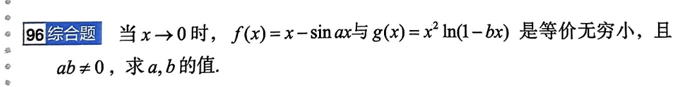

# 题目讲解及时间标识：2026-09-24_22-18-35

- **记录时间**：2026-09-24 22:18:35
- **时区**：Asia/Shanghai（CST，UTC+08:00）
- **原图**：
- **Notion 同步状态**：待同步。当前会话没有可调用的 Notion 工具；目标为 [local-question-bank](https://www.notion.so/3e4867d026d980a9b79ce8eeb831631a)。该题已经有一份较早的本地与 Notion 记录，本次新增内容应补充到原有第 96 题解析中，不重复创建题目。

## 第 96 题 · 原题

**96 综合题**

当 $x\to0$ 时，$f(x)=x-\sin ax$ 与 $g(x)=x^2\ln(1-bx)$ 是等价无穷小，且 $ab\ne0$，求 $a,b$ 的值。

## 条件与前提检查

- “等价无穷小”表示 $f(x)$、$g(x)$ 都趋于 0，并且 $\displaystyle\lim_{x\to0}\frac{f(x)}{g(x)}=1$。
- $a,b$ 是常数，且 $ab\ne0$。
- 因为 $1-bx\to1$，所以在 $x=0$ 的充分小邻域内，$\ln(1-bx)$ 有定义。

## 什么时候可以进行等价无穷小代换

### 1. 乘积或商中的完整因子，可以直接代换

如果 $u(x)\sim U(x)$，那么在乘积或商中，可以把完整因子 $u(x)$ 换成 $U(x)$。例如

$$
\frac{1-\cos x}{\sin^2x}
\sim
\frac{x^2/2}{x^2}
=\frac12.
$$

本题中的

$$
g(x)=x^2\ln(1-bx)
$$

是乘积。因为 $-bx\to0$，所以

$$
\ln(1-bx)\sim-bx,
$$

从而可以直接得到

$$
g(x)\sim-bx^3.
$$

### 2. 和或差中，先检查最低阶项会不会抵消

等价无穷小不能无条件地逐项代入和或差。真正要看的，是代换后最低阶项的系数之和是否为 0。

- 最低阶项不抵消，可以使用这些首项。
- 最低阶项抵消，当前近似精度不够，必须继续展开到下一个非零项。

例如

$$
\sin x+\tan x=x+o(x)+x+o(x)\sim2x.
$$

两个一次项相加得到 $2x$，没有抵消，所以一次近似已经够用。

但对

$$
x-\sin x,
$$

如果只使用 $\sin x\sim x$，会得到 $x-x=0$。这里的 0 只说明一次项抵消了，不能说明原式等价于 0。继续展开：

$$
\sin x=x-\frac{x^3}{6}+o(x^3),
$$

所以

$$
x-\sin x=\frac{x^3}{6}+o(x^3)\sim\frac{x^3}{6}.
$$

### 3. 复合函数要使用对应的标准关系，不能随意替换内部表达式

当 $u\to0$ 时，下面这些关系可以直接使用：

$$
\sin u\sim u,\qquad \tan u\sim u,\qquad
1-\cos u\sim\frac{u^2}{2},\qquad
\ln(1+u)\sim u,\qquad e^u-1\sim u.
$$

其中 $u$ 可以是一个趋于 0 的复杂表达式。但仅由 $u\sim v$，不能在任意外函数中把 $u$ 换成 $v$。例如当 $x\to0^+$ 时，$x+x^2\sim x$，可是

$$
\frac{e^{-1/(x+x^2)}}{e^{-1/x}}
=e^{1/(1+x)}\to e\ne1.
$$

因此复合函数代换必须有对应的标准等价关系或定理作为依据；若这些函数又处在和或差里，还要检查代换后的首项是否抵消。

## 一个实用判断顺序

1. 先看最外层运算是乘除，还是加减。
2. 乘除中的完整因子优先使用等价无穷小。
3. 加减先写出各项最低阶项和系数。
4. 若最低阶系数抵消，继续展开，直到出现第一个非零项。
5. 最后检查“原式除以近似式”的极限是否为 1。

可以把第 4 步记成一句话：**代换后首项不为 0，可以停；代换后首项为 0，继续展开。**

## 本题解题思路

先在乘积 $g(x)$ 中安全地代换对数因子，确定 $g(x)$ 是三阶无穷小。再检查差 $f(x)=x-\sin(ax)$ 的一次项是否抵消；抵消后把正弦展开到三阶，比较三阶系数。

## 详细解析

由

$$
\ln(1-bx)\sim-bx
$$

可得

$$
g(x)=x^2\ln(1-bx)\sim-bx^3.
$$

因为 $b\ne0$，所以 $g(x)$ 的首个非零项是三次项。$f(x)$ 与它等价，$f(x)$ 也必须从三次项开始。

先使用 $\sin(ax)=ax+o(x)$ 检查 $f(x)$ 的一次项：

$$
f(x)=x-\sin(ax)=(1-a)x+o(x).
$$

若 $a\ne1$，则 $f(x)$ 是一阶无穷小，不可能与三阶的 $g(x)$ 等价。因此一次项必须抵消：

$$
1-a=0,
$$

所以

$$
a=1.
$$

此时代换后的首项变成了 0，必须继续展开：

$$
x-\sin x
=x-\left(x-\frac{x^3}{6}+o(x^3)\right)
=\frac{x^3}{6}+o(x^3)
\sim\frac{x^3}{6}.
$$

于是

$$
f(x)\sim\frac{x^3}{6},\qquad g(x)\sim-bx^3.
$$

等价无穷小的首项系数必须相同，因此

$$
\frac16=-b,
$$

得到

$$
b=-\frac16.
$$

## 最终答案

$$
\boxed{a=1,\qquad b=-\frac16}.
$$

## 检验与易错点

代入 $a=1$、$b=-\frac16$：

$$
x-\sin x\sim\frac{x^3}{6},
$$

并且

$$
x^2\ln\left(1+\frac{x}{6}\right)
\sim x^2\cdot\frac{x}{6}
=\frac{x^3}{6}.
$$

因此两者之比趋于 1，且 $ab=-\frac16\ne0$，符合全部条件。

本题最容易混淆的地方是：$\sin(ax)\sim ax$ 可以用来检查一次项是否抵消；当 $a=1$ 使一次项抵消后，不能把 $x-\sin x$ 判成 0，必须使用更高阶展开。
