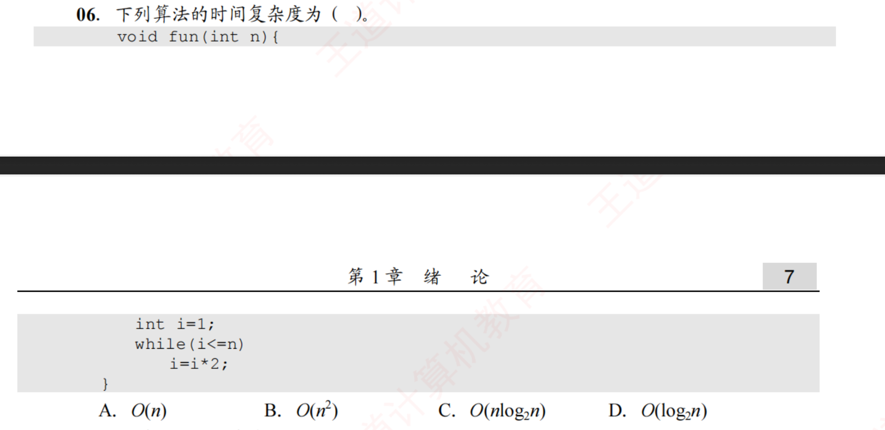

# 题目讲解 · 2026-09-30_18-07-01

- 记录时间：2026-09-30 18:07:01
- 时区：Asia/Shanghai（UTC+08:00）
- 原图：`photo/2026-09-30_18-07-01.png`
- Notion 同步状态：已同步，已重新读取核验完整正文、代码、公式与四层嵌套。
- Notion 页面：[local-question-bank](https://app.notion.com/p/3e4867d026d980a9b79ce8eeb831631a?pvs=204)
- Notion 位置：2026年 → 09月 → 30日 → 第 06 题 · 题干 / 第 06 题 · 解析。

## 第 06 题

### 原题与题图



**06. 下列算法的时间复杂度为（　）。**

```c
void fun(int n){
    int i=1;
    while(i<=n)
        i=i*2;
}
```

- A. $O(n)$
- B. $O(n^2)$
- C. $O(n\log_2 n)$
- D. $O(\log_2 n)$

### 条件与前提检查

图片中的函数声明和函数体跨页，合并后代码完整。循环条件是 `i<=n`，更新语句是 `i=i*2`。

按教材通常采用的分析模型，将 $n$ 视为正整数，比较、赋值和乘以 2 都计为常数时间，并假设整数运算不会溢出。在真实 C 程序中，带符号 `int` 溢出属于未定义行为；本题的渐近复杂度分析采用上述理想化模型。

题目按选择题惯例要求最紧的增长阶。严格来说，$O$ 表示渐近上界，较大的上界也可以成立；本题的精确增长阶为 $\Theta(\log n)$，对应选项 D。

### 解题思路

已知 `i` 从 1 开始，每次循环翻倍；要求程序的运行时间随 $n$ 增大的增长规律。

每轮只做常数次基本操作，所以关键是数清循环体执行了多少次。先写出执行 $k$ 次后 `i` 的值，再用停止条件求 $k$。

### 详细解析

**第一步：观察 `i` 的变化。**

初始时 $i=1$。执行一次后 $i=2$，执行两次后 $i=4$，执行三次后 $i=8$。每次乘以 2，因此执行 $k$ 次后：

$$
i=2^k.
$$

**第二步：利用停止条件求循环次数。**

只要 $i\le n$，循环就继续。循环终止时，`i` 首次大于 $n$，所以总次数 $k$ 是满足以下条件的最小整数：

$$
2^k>n.
$$

因为以 2 为底的对数函数单调递增，两边取对数可以保留不等号方向：

$$
k>\log_2 n.
$$

于是对于整数 $n\ge1$，精确次数为：

$$
k=\lfloor\log_2 n\rfloor+1.
$$

其中 $\lfloor x\rfloor$ 表示向下取整，即不超过 $x$ 的最大整数。循环条件包含等号，所以当 $n=2^m$ 时，`i` 到达 $n$ 后还会执行一轮，次数是 $m+1$。

**第三步：由循环次数得到时间复杂度。**

初始化执行 1 次，循环体执行 $k$ 次，循环条件判断执行 $k+1$ 次。每次操作的耗时都按常数计算，因此总时间与 $k$ 的增长阶相同：

$$
T(n)=\Theta(\log_2 n).
$$

向下取整和加 1 不改变渐近增长阶，因此选项写作 $O(\log_2 n)$。

### 最终答案

**选 D。**

$$
\boxed{O(\log_2 n)}
$$

### 检验与易错点

- 取 $n=8$，`i` 依次为 $1\to2\to4\to8\to16$，循环执行 4 次，与 $\lfloor\log_2 8\rfloor+1=4$ 一致。
- 取 $n=7$，`i` 依次为 $1\to2\to4\to8$，循环执行 3 次，与 $\lfloor\log_2 7\rfloor+1=3$ 一致。
- 取 $n=1$，循环执行 1 次；若 $n\le0$，第一次判断就不满足，循环执行 0 次。渐近结论讨论的是 $n\to\infty$。
- 循环次数由变量的更新方式和停止条件决定；每次翻倍时，应通过 $2^k>n$ 求次数。
- `<=` 会影响精确次数，但不改变对数增长阶。
- 对数换底只产生常数因子，因此通常也写作 $O(\log n)$。
