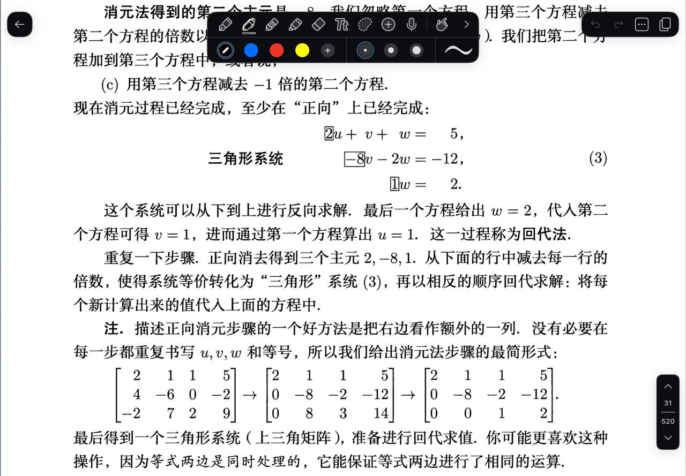

# 题目讲解 · 2026-10-01_23-40-44

- 记录时间：2026-10-01 23:40:44
- 时区：Asia/Shanghai（UTC+08:00）
- 原图：`photo/2026-10-01_23-40-44.jpg`
- Notion 同步状态：已同步；2026年 → 10月 → 01日 → 第 2026-10-01_23-40-44 题 · 题干/解析。
- Notion 页面：[local-question-bank](https://app.notion.com/p/3e4867d026d980a9b79ce8eeb831631a?pvs=204)

## 矩阵消元法（时间标识：2026-10-01_23-40-44）

### 原题与题图

用户问题：这个矩阵消元法我没有看懂。

图片底部给出的消元过程为：

$$
\begin{bmatrix}
2&1&1&5\\
4&-6&0&-2\\
-2&7&2&9
\end{bmatrix}
\longrightarrow
\begin{bmatrix}
2&1&1&5\\
0&-8&-2&-12\\
0&8&3&14
\end{bmatrix}
\longrightarrow
\begin{bmatrix}
2&1&1&5\\
0&-8&-2&-12\\
0&0&1&2
\end{bmatrix}.
$$

教材对应的“三角形系统”（标号为式（3），并非题号）是：

$$
\begin{cases}
2u+v+w=5,\\
-8v-2w=-12,\\
w=2.
\end{cases}
$$

教材说明：从下到上回代得到 $w=2$、$v=1$、$u=1$；正向消元的三个主元为 $2,-8,1$。图片中可见的（c）步骤为“用第三个方程减去 $-1$ 倍的第二个方程”。

### 条件与前提检查

图片顶部部分文字被工具栏遮挡；底部三个矩阵、三角形系统及回代结论清晰，足以重建完整运算。遮挡文字不补写为原文。

未知量的列顺序固定为 $u,v,w$，最后一列记录等号右边的常数。原方程组从第一个矩阵读出：

$$
\begin{cases}
2u+v+w=5,\\
4u-6v+0w=-2,\\
-2u+7v+2w=9.
\end{cases}
$$

所有系数与常数都已给出，无需额外假设。图中没有单位。

### 解题思路

已知三个方程，要理解每个箭头的运算，并求出 $u,v,w$。

先用第一个方程消去下面两个方程中的 $u$，再用新的第二个方程消去第三个方程中的 $v$。这样最后一行只含 $w$，便可以从下往上逐个求出未知量。

### 详细解析

#### 1. 矩阵每一行都代表一个方程

第一行 $[2,1,1,5]$ 表示 $2u+1v+1w=5$。第二行 $[4,-6,0,-2]$ 表示 $4u-6v+0w=-2$。其中 $0$ 表示这一项没有出现，仍需保留位置，保证每一列对应同一个未知量。

把系数和右边常数合在一起记录，叫作“增广矩阵”。为方便区分，可以在最后一列前加一道竖线：

$$
\left[\begin{array}{ccc|c}
2&1&1&5\\
4&-6&0&-2\\
-2&7&2&9
\end{array}\right].
$$

矩阵里的行运算就是方程运算的简写；四个位置都必须一起计算。

#### 2. 第一个箭头：消去下面两行的 $u$

用 $R_1,R_2,R_3$ 分别表示当前的第一、第二、第三行。符号 $R_2\leftarrow R_2-2R_1$ 表示“用第二行减去两倍第一行，所得结果替换第二行”。第一行本身保留。

第二行的 $u$ 系数是 $4$，第一行的 $u$ 系数是 $2$。因为 $4-2\times2=0$，选择：

$$
R_2\leftarrow R_2-2R_1.
$$

逐个位置计算：

$$
\begin{aligned}
[4,-6,0,-2]-2[2,1,1,5]
&=[4-4,-6-2,0-2,-2-10]\\
&=[0,-8,-2,-12].
\end{aligned}
$$

对应的方程运算为：

$$
\begin{aligned}
(4u-6v+0w)-2(2u+v+w)&=-2-2\times5,\\
-8v-2w&=-12.
\end{aligned}
$$

第三行的 $u$ 系数是 $-2$，加上第一行的 $2$ 就能得到 $0$，所以选择：

$$
R_3\leftarrow R_3+R_1.
$$

逐个位置计算：

$$
[-2,7,2,9]+[2,1,1,5]=[0,8,3,14].
$$

对应方程变为 $8v+3w=14$。于是第一个箭头之后的方程组是：

$$
\begin{cases}
2u+v+w=5,\\
-8v-2w=-12,\\
8v+3w=14.
\end{cases}
$$

此时下面两行都没有 $u$，但第三行还有 $v$，因此继续消元。

#### 3. 第二个箭头：消去第三行的 $v$

现在第二行的 $v$ 系数是 $-8$，第三行的 $v$ 系数是 $8$。两行相加，$v$ 就会消失：

$$
R_3\leftarrow R_3+R_2.
$$

这里的 $R_2,R_3$ 都是第一个箭头之后的行。

$$
\begin{aligned}
[0,8,3,14]+[0,-8,-2,-12]
&=[0,0,1,2].
\end{aligned}
$$

还原成方程，就是：

$$
\begin{aligned}
(8v+3w)+(-8v-2w)&=14+(-12),\\
w&=2.
\end{aligned}
$$

教材说“减去 $-1$ 倍的第二个方程”，因为：

$$
R_3-(-1)R_2=R_3+R_2.
$$

一般地，要用某行消去下面一行的一项，就计算“下面这一项的系数 ÷ 用来消元的系数”。本题三次倍数依次是 $4/2=2$、$-2/2=-1$、$8/(-8)=-1$，然后从目标行减去这个倍数的参考行。

#### 4. 为什么这样的行变换不改变答案？

原方程同时成立时，用一个方程减去另一个方程的若干倍，得到的新方程也成立。

还需要确认能恢复原方程。以 $R_2\leftarrow R_2-2R_1$ 为例：第一行保留，只要对新的第二行加上 $2R_1$，就恢复原来的第二行。因此原方程组和新方程组的解完全相同，这叫“等价变换”。

后面两次加法也可以通过减法恢复。每一步只替换目标行，并保留提供消元依据的行。

#### 5. 为什么叫三角形系统？主元是什么？

最终前三列是系数矩阵：

$$
\begin{bmatrix}
2&1&1\\
0&-8&-2\\
0&0&1
\end{bmatrix}.
$$

它的主对角线下面都是 $0$，称为“上三角矩阵”。完整的增广矩阵是 $3\times4$；教材中的“上三角”描述的是前三列组成的系数矩阵。

对应方程从上往下分别含三个、两个、一个未知量。各行用来逐步求解的首个非零系数 $2,-8,1$ 称为“主元”。本题三个主元都非零，所以可以依次唯一确定三个未知量。

#### 6. 从下往上回代

最后一个方程直接给出 $w=2$。代入第二个方程：

$$
-8v-2\times2=-12
\quad\Longrightarrow\quad
-8v=-8
\quad\Longrightarrow\quad
v=1.
$$

再把 $v=1,w=2$ 代入第一个方程：

$$
2u+1+2=5
\quad\Longrightarrow\quad
2u=2
\quad\Longrightarrow\quad
u=1.
$$

“回代”就是把已经求出的未知量代入上面的方程，求出下一个未知量。

### 最终答案

$$
\boxed{u=1,\qquad v=1,\qquad w=2}.
$$

本题的完整行变换顺序为：

$$
R_2\leftarrow R_2-2R_1,\qquad
R_3\leftarrow R_3+R_1,\qquad
R_3\leftarrow R_3+R_2.
$$

先消去下面方程的 $u$，再消去第三个方程的 $v$，最后从下往上回代。

### 检验与易错点

把答案代回三个原方程：

$$
\begin{aligned}
2\times1+1+2&=5,\\
4\times1-6\times1+0\times2&=-2,\\
-2\times1+7\times1+2\times2&=9.
\end{aligned}
$$

三个等式全部成立。行变换也都可以逆向恢复，没有丢失原方程的约束。

- 最后一列也属于整行运算：第二行的常数变为 $-2-2\times5=-12$。
- “减去负一倍”就是加上原来的那一行；注意负号。
- 第二个箭头用的是已经更新过的第二行和第三行。
- 本题消元时只需让主元下面的元素变为 $0$；主元上面的元素可以保留，再通过回代求解。
- 主元不必都化为 $1$；本题直接保留 $2,-8,1$ 即可完成求解。
